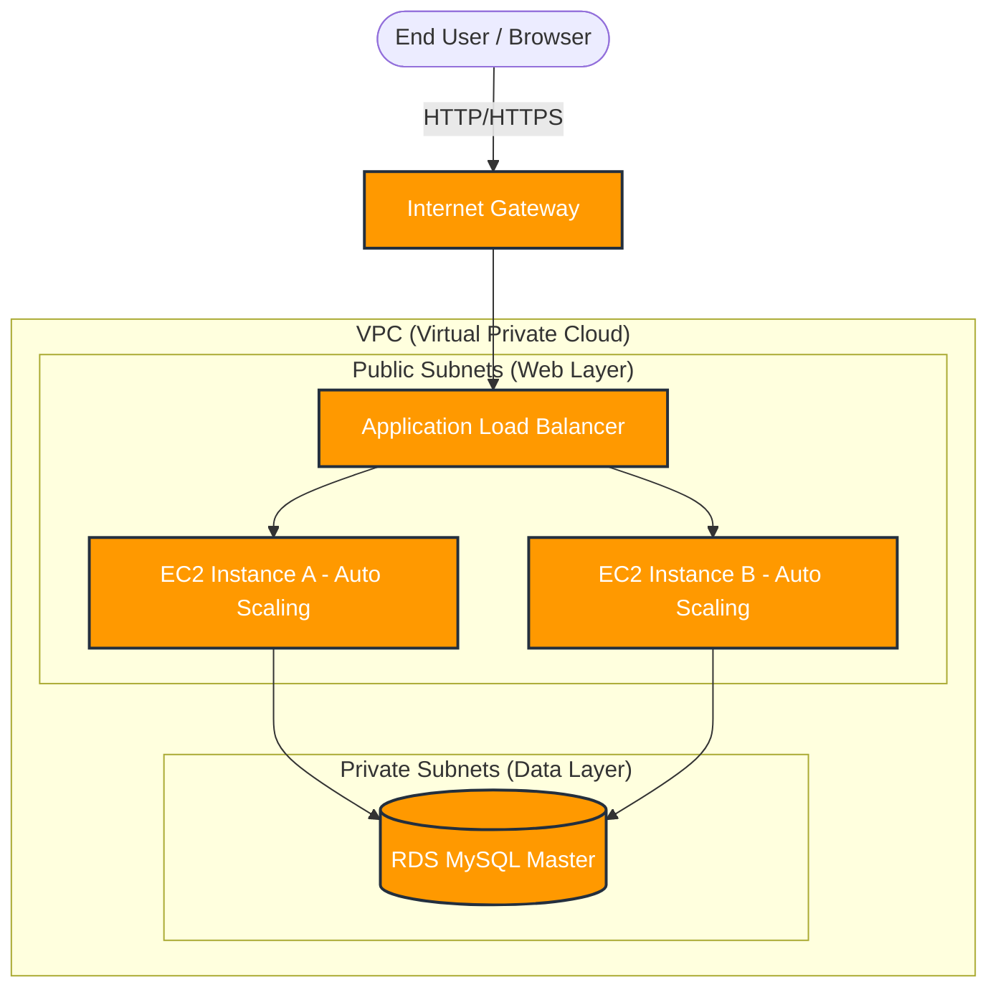

# Travel Booking Platform - Complete Project Architecture

This document explains the architecture of the Travel Booking Platform from start to finish. We'll cover what we created, why we made certain architectural decisions, and how the system handles a user request.

---

## 1. The High-Level Architecture

The project is built on a standard **3-Tier AWS Web Architecture**. This is the industry standard for secure, scalable, and highly available web applications.

### 1.1 The Visual Flow

---

## 2. Step-by-Step Breakdown: What We Created and Why

### Step 1: Virtual Private Cloud (VPC)
- **What it is:** A logically isolated section of the AWS cloud where we launch our resources. It's like our own private network in the sky.
- **Why we created it:** For security. By having our own VPC, we control exactly who can come in and out.

### Step 2: Public and Private Subnets
- **What they are:** We split the VPC into two types of subnets across two different Availability Zones (for high availability).
  - **Public Subnets:** Connected to the internet (via an Internet Gateway).
  - **Private Subnets:** No direct internet access.
- **Why we created them:** To protect our database. The database is placed in the private subnet so hackers on the internet cannot reach it directly. The web servers (EC2) are in the public subnet so users can see the website.

### Step 3: Application Load Balancer (ALB)
- **What it is:** The ALB sits at the very front of our public subnets. It receives all incoming traffic from users and distributes it evenly across our EC2 instances.
- **Why we created it:** If one EC2 server gets overloaded with 10,000 users trying to book flights, the ALB sends new users to a second EC2 server to keep the website fast and prevent crashing.

### Step 4: EC2 Auto Scaling Group (The Web & App Layer)
- **What it is:** A group of EC2 instances (virtual servers) running Amazon Linux 2.
- **Why we created it:** Auto Scaling monitors our traffic. If traffic spikes, it automatically launches more EC2 instances (scaling out). If traffic drops, it terminates them to save money (scaling in).
- **What runs on these EC2 instances?**
  1. **NGINX:** A web server that serves our Frontend (HTML, CSS, JS).
  2. **Gunicorn + Systemd:** A process manager that keeps our Backend (Python Flask) running 24/7.

### Step 5: Amazon RDS MySQL (The Data Layer)
- **What it is:** A managed relational database running MySQL.
- **Why we created it:** To store persistent data (Flights, Hotels, User Bookings, Admin accounts). We use RDS instead of installing MySQL manually on an EC2 instance because AWS RDS automatically handles backups, patching, and hardware failures for us.

---

## 3. The Lifecycle of a User Request

Here is exactly what happens when a user goes to your website and searches for a flight:

1. **The Request:** The user types your ALB's URL into their browser.
2. **The ALB:** The ALB receives the request and forwards it to a healthy EC2 instance in the Auto Scaling Group.
3. **NGINX (Frontend):** NGINX on the EC2 instance answers the request by serving the `index.html` file (your beautiful, glassmorphic UI).
4. **The Search:** The user fills out the Flight Search form and clicks "Search". The JavaScript in the browser (`app.js`) sends an API request (e.g., `GET /api/search`).
5. **NGINX (Reverse Proxy):** NGINX catches this `/api/` request and says, "Ah, this isn't a static file, this is for the backend!" It forwards the request to your Python Flask app running on port 5000.
6. **Flask (Backend):** Python receives the search criteria. It securely connects to the RDS MySQL database in the private subnet using the credentials from its `.env` file.
7. **RDS (Database):** The database runs the SQL query and returns the matching flights to Python.
8. **The Response:** Python converts the flights into JSON data, sends it back through NGINX, back through the ALB, and finally back to the user's browser, where JavaScript displays the results on the screen!

---

## 4. How CloudFormation Ties It All Together

Instead of manually clicking through the AWS Console to create the VPC, subnets, EC2s, and RDS, we wrote a single file: `travel_booking_platform.yaml`.

This is called **Infrastructure as Code (IaC)**. 
- **Why we use it:** It guarantees that our infrastructure is identical every single time we deploy it. It saves hours of manual work, prevents human error, and acts as living documentation of our architecture.
